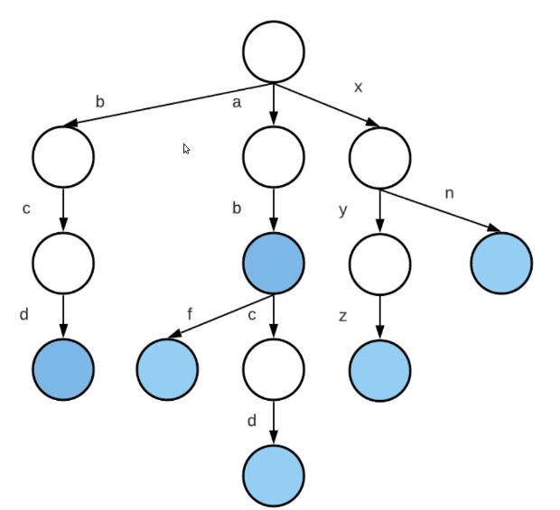

# what is trie ?

- a tire is a data strucure which is used to sort dynamic set of strings.
- in general it's m-array tree where edge has a letter.
- in letter tree a word of N letters spans N nodes.
  
- colored nodes means that it's end of a word.
- now you can iterate in O(n)
> It's important to note that while tries are efficient, there are other data structures that can be more suitable for certain tasks, such as suffix arrays and suffix trees.

# impelementation :
### how can we build data structure like that ?
- 
